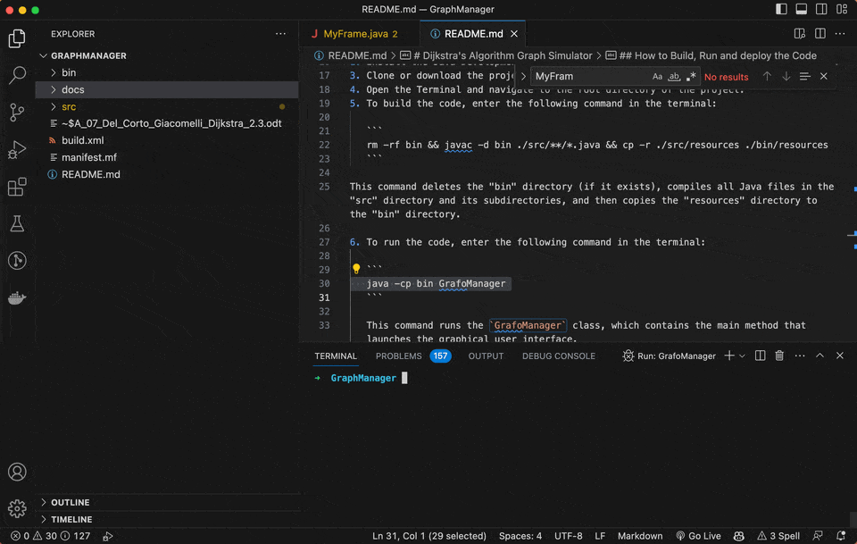

# Dijkstra's Algorithm Graph Simulator



This Java project allows to try the Dijkstra's algorithm on a directed graph that users can build with a graphical user interface.

The user interface allows you to input the following information:
- The total number of nodes in the graph (node IDs are automatically assigned starting from 0 and incrementing by 1)
- An edge, including the start node, end node, and weight of the edge
- Execution of Dijkstra's algorithm on the graph. You have two options for this: either input only the start node, and the program will calculate the shortest path to visit all nodes, or input both the start and end nodes, and the program will calculate the shortest path between the two nodes.

## How to Build and Run the Code

To build and run the project in Visual Studio Code, you'll need to do the following:

1. Install the Java Development Kit (JDK) on your system if you haven't already done so.
3. Clone or download the project repository from GitHub.
4. Open the Terminal and navigate to the root directory of the project.
5. To build the code, enter the following command in the terminal: 

   ```
   rm -rf bin && javac -d bin ./src/**/*.java && cp -r ./src/resources ./bin/resources
   ```

This command deletes the "bin" directory (if it exists), compiles all Java files in the "src" directory and its subdirectories, and then copies the "resources" directory to the "bin" directory.
   
6. To run the code, enter the following command in the terminal:

   ```
   java -cp bin GrafoManager
   ```

   This command runs the `GrafoManager` class, which contains the main method that launches the graphical user interface. 
